# Emart - Your Ultimate Shopping Experience

Welcome to Emart, your one-stop solution for all your shopping needs. Emart is a feature-rich e-commerce application built with Flutter. It offers a wide range of features to enhance your shopping experience.

## Features

- **Firebase Integration:** Emart uses Firebase for its database, ensuring real-time data synchronization.

- **Chat Functionality:** Communicate seamlessly with both customers and retailers through the built-in chat feature.

- **Stunning UI:** Our app boasts a captivating and user-friendly interface designed to enhance your shopping journey.

- **Wide Range of Categories:** Explore a plethora of categories, including Women's Dress, Men's Clothing and Fashion, Computers and Accessories, Automobiles, Kids & Toys, Cellphones, and Jewelry.

- **User Profiles:** Create and customize your user profile to personalize your shopping experience.

- **Today's Deals:** Stay updated with our daily deals and never miss out on great offers.

- **Top Categories:** Easily navigate and discover products in our top categories.

- **Shopping Cart:** Add, edit, and delete items in your shopping cart. Keep track of your total price as you shop.

- **Retailer Ratings:** Check out ratings and reviews from other users to make informed decisions when choosing a retailer.

## Screenshots

  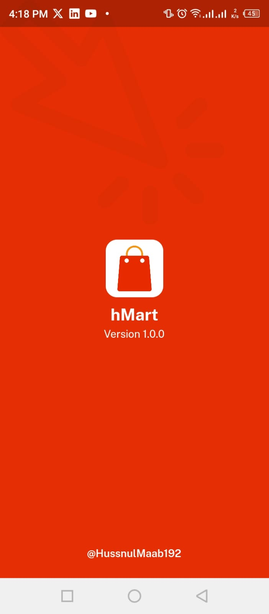
  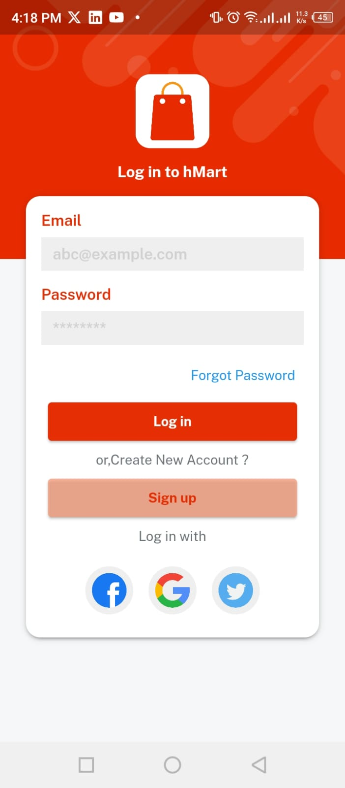
  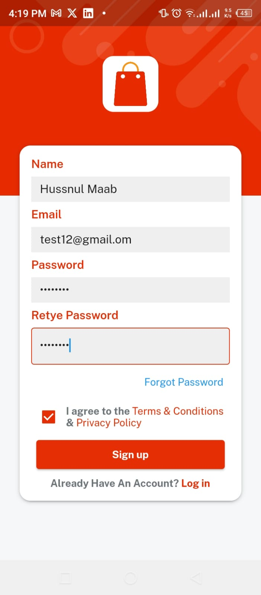
  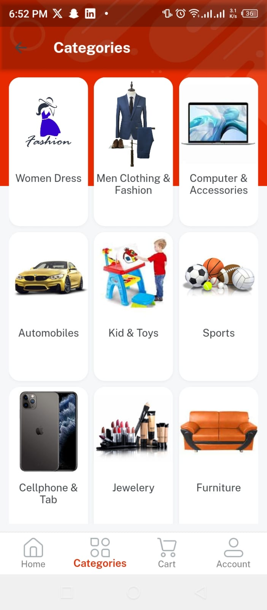

  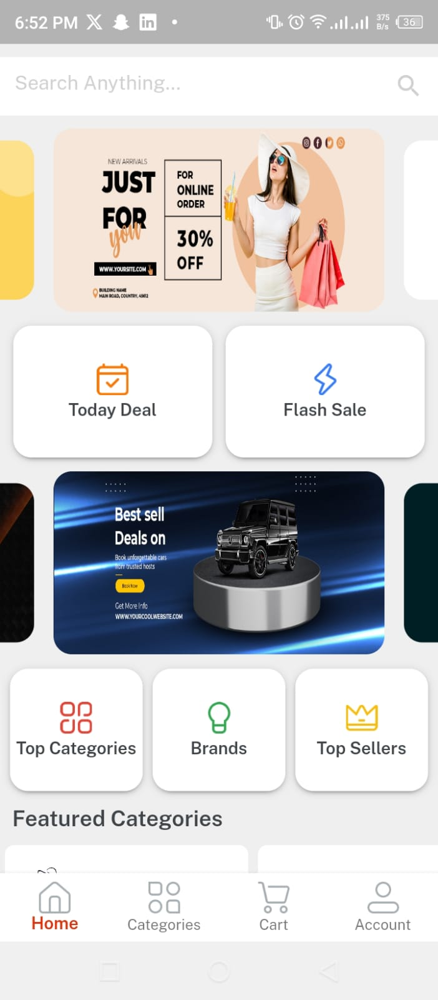
  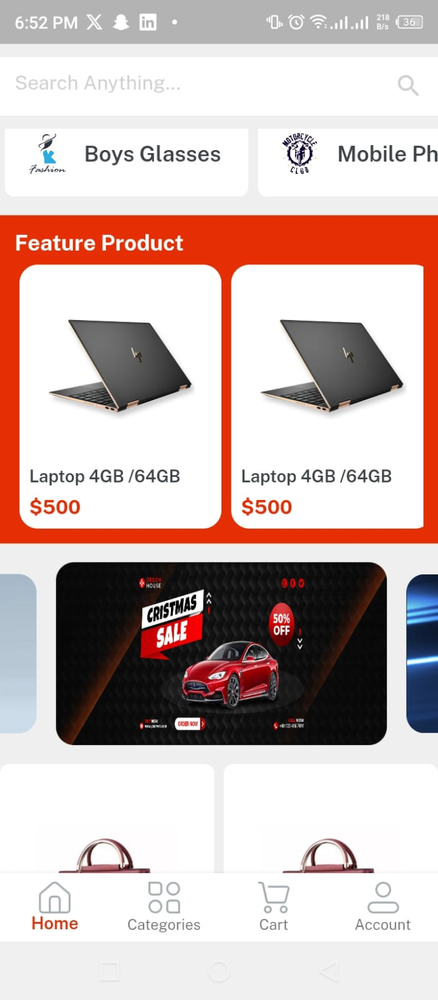
  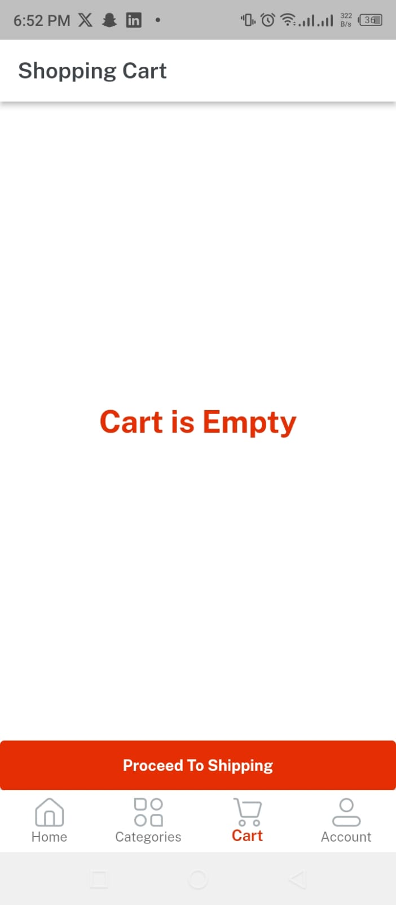
  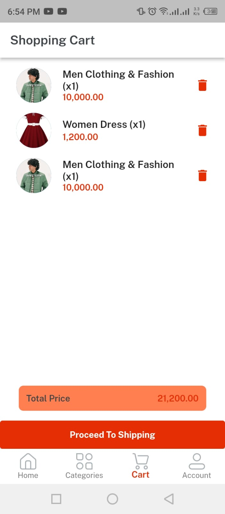

  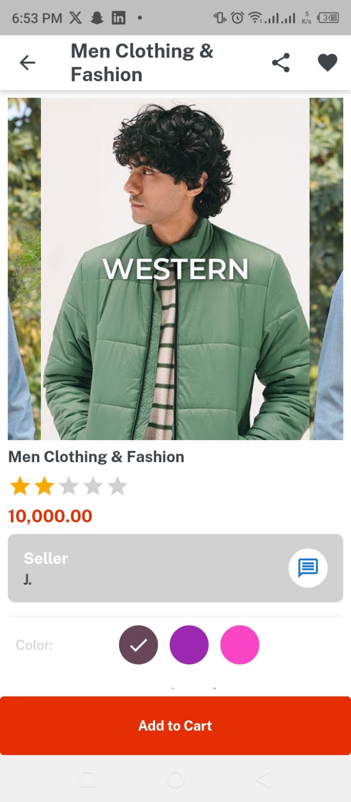
  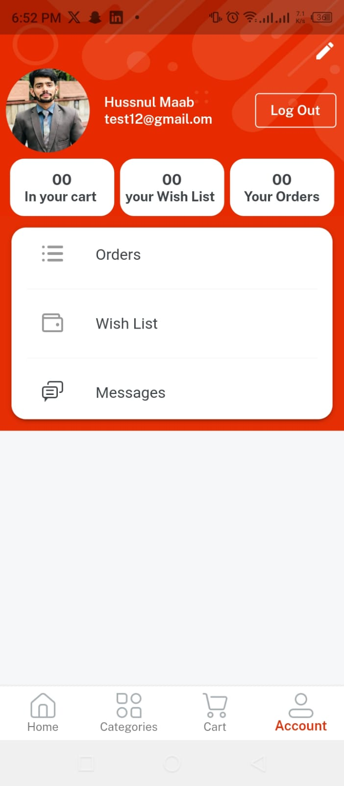
  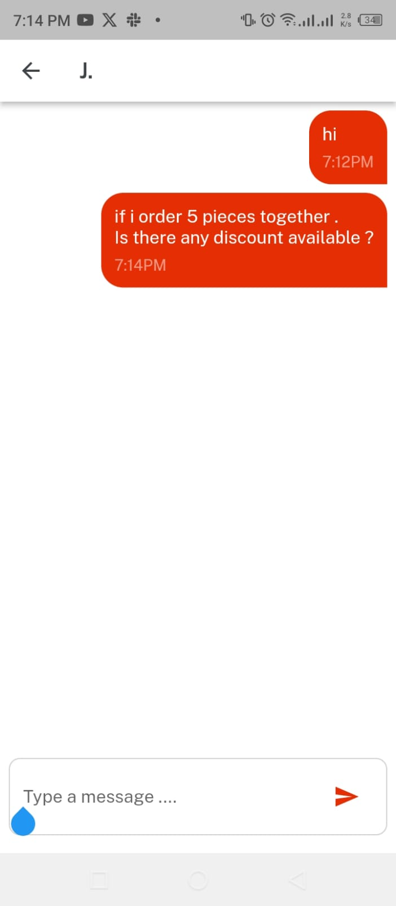

## Getting Started

To get started with Emart, follow these steps:

1. Clone the repository to your local machine.
2. Set up Firebase for database functionality.
3. Customize the app to fit your business needs.
4. Build and run the app on your preferred platform.

Enjoy the ultimate shopping experience with Emart!

## Contributing

We welcome contributions from the community. If you'd like to contribute to the development of Emart, please follow our [Contribution Guidelines](CONTRIBUTING.md).

## License

This project is licensed under the MIT License - see the [LICENSE](LICENSE) file for details.

